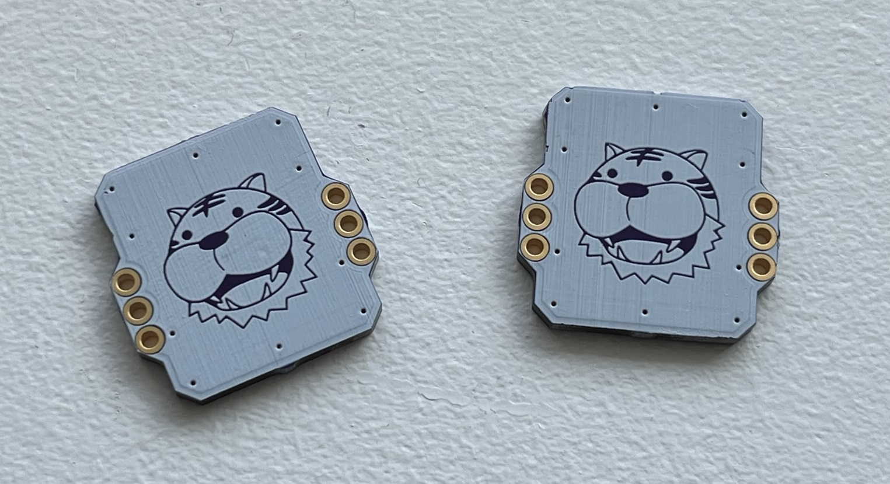
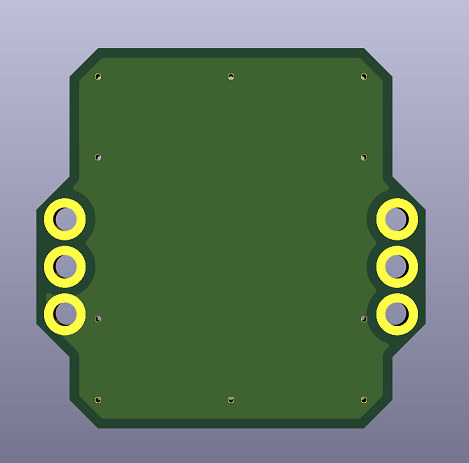
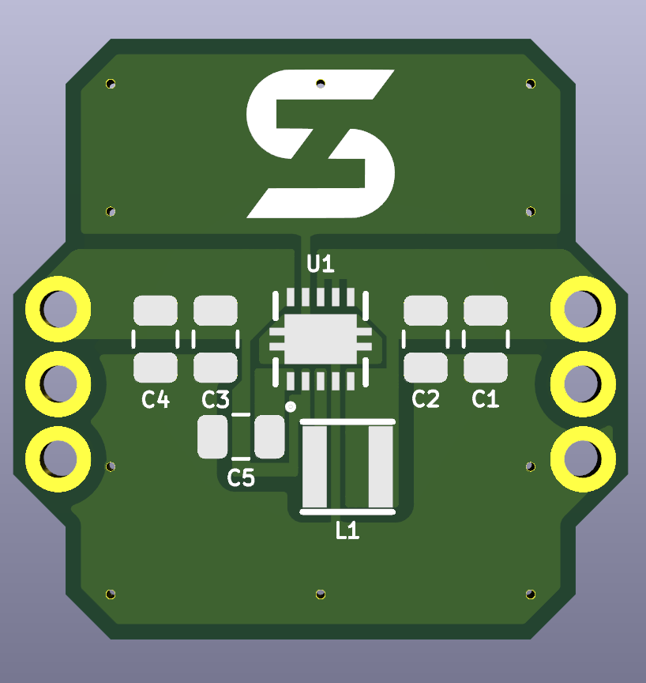

# SZ Regulator (SZ-REG)
The SZ Regulator or SZ-REG is a simple 5V regulator to power your Game Boy Pocket or Game Boy Color. This power regulator is only compatible with IPS kits and cannot be used with OEM MGB/CGB screens

# Customization / Ordering

*Customizable*

If you would like a SZ Regulator with a customized silkscreen image, you can make a request through my Ko-fi.  I will convert an image that you provide, place it on the SZ Regulator, and send you the gerber so that you can order from a PCB fab.

- [Ko-fi](https://ko-fi.com/skimzor)

*Blank*

A version of the SZ Regulator without any silkscreen/image is available in this github as a gerber. Upload the gerber to a PCB fab (JLCPCB, PCBWay, OSHPark) with a board thickness of at least 1.6mm, HASL, and in your favorite color. 

# Bill of Materials

| Reference | Value | Package |
| :---: | :---: | :---: |
| C1 | 10uF | 0805 |
| C2 | 0.1uF | 0805 |
| C3 | 10uF | 0805 |
| C4 | 10uF | 0805 |
| C5 | 0.1uF | 0805 |
| L1 | 2.2uH | NR3015T2R2M |
| U1 | 5V REG | TPS61202DSCR |

# Disclaimer

Assembly of this PCB requires micro-soldering experience; you will be required to solder a QFN chip as well as SMD components.

If you have suggestions to improve or identify issues with the PCB design, please contact me on discord: *skimzor#5078*.

# License

 
 
This project/PCB is licensed under a Creative Commons Attribution-NonCommercial-ShareAlike 4.0 International License. ***Under this license, you are not permitted to profit from or commercialize this project.***
